# Стек технологий
## Тесты

## Инфраструктура
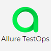

## Интеграция

---------------

# Видео-пример прохождения теста

---------------

## Процесс тестирования

### [Github repository](https://github.com/Gorbatenko/qa_guru_4_home_24 "Github repository")

---------------
- [x] Весь код проекта.
### [Jenkins job](https://jenkins.autotests.cloud/view/QA.GURU_4/job/C04-G14-Vitaliy-qa_guru_4_24_Diploma/ "Jenkins job")

---------------
- [x] Параметризована задача
- [x] Запуск вручную или по времени

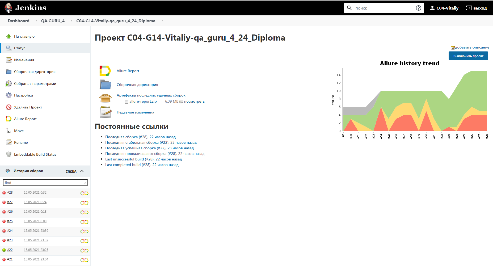
### [Allure TestOps project](https://allure.autotests.cloud/project/180/dashboards "Allure TestOps")

---------------
- [x] Общий список тестов всего проекта
- [x] Консолидация мета-информации о каждом тест-кейсе. Шаги, владелец, связанные задачи и т.д.
- [x] Запуск выбранных автотестов 
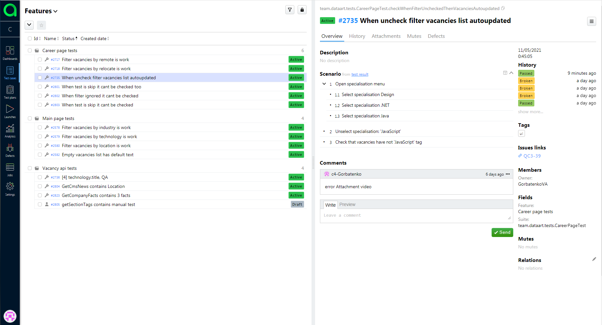

- [x] Список прогонов тестов
- [x] Отображение параметров тестового окружения
- [x] Краткая информация о результатах прогона
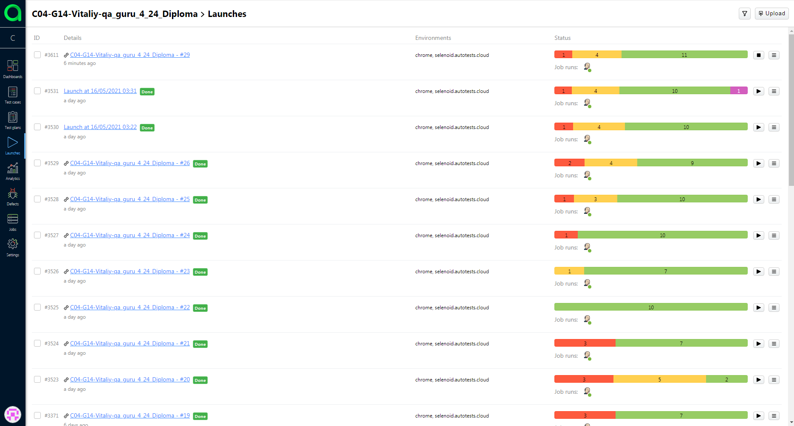
- [x] Общий дашборд по прогону автотестов.
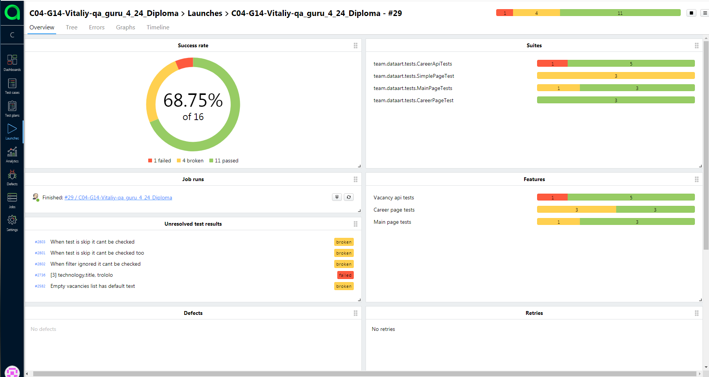
- [x] Развёрнутая информация по каждому тесту.
- [x] Прикреплённые видео прохождения теста, скриншоты, логи браузера, информация о запросах-ответах (для апи-тестов)
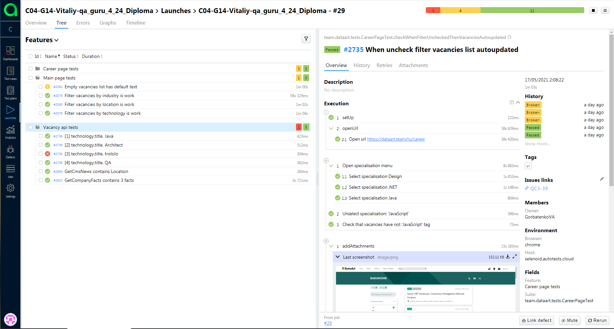
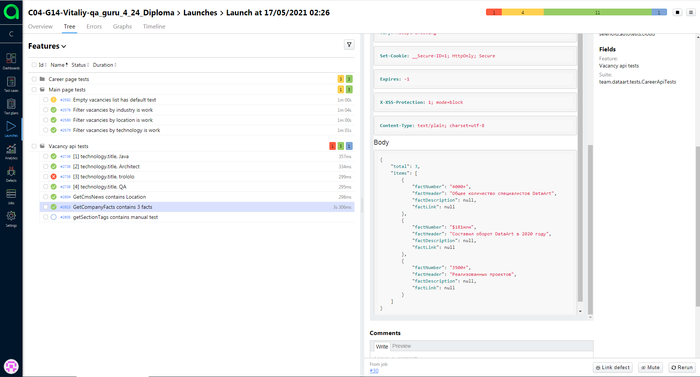
- [x] Параллельный запуск тестов в пять потоков.
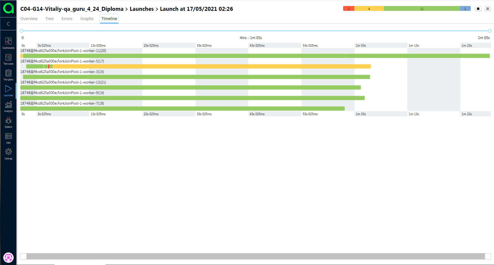
### [Allure report](https://jenkins.autotests.cloud/view/QA.GURU_4/job/C04-G14-Vitaliy-qa_guru_4_24_Diploma/allure/ "Allure report")

---------------
- [x] Общий дашборд по прогону автотестов.
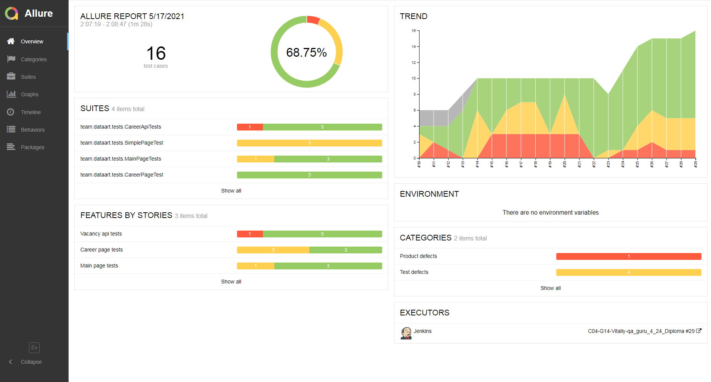
- [x] Развёрнутая информация по каждому тесту. 
- [x] Прикреплённые видео прохождения теста, скриншоты, логи браузера, информация о запросах-ответах (для апи-тестов) 
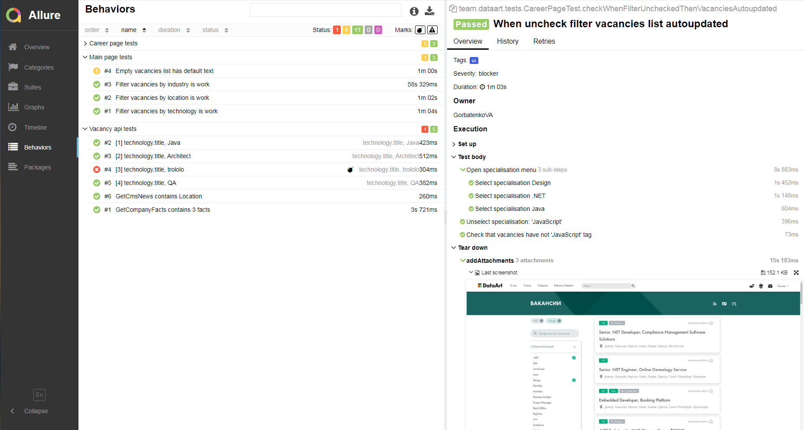
### [Jira issue](https://jira.autotests.cloud/browse/QC3-39 "Jira issue")

---------------
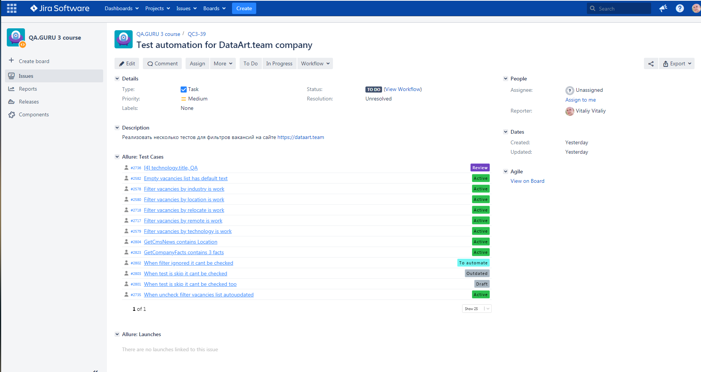
### [Telegram notification](https://t.me/joinchat/1VaD2Kb36OlhOGRi "Telegram notification")

---------------
- [x] В конце каждого прогона тестов информативное сообщение в телеграм-чат
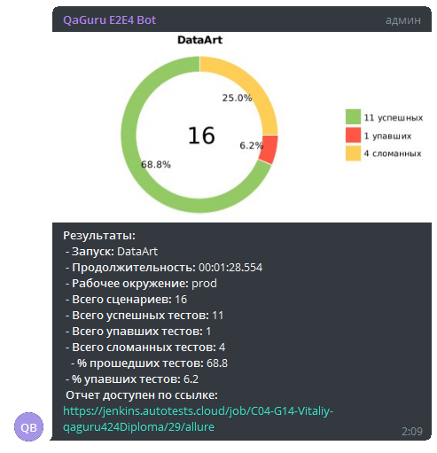
