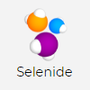

#Стек технологий
##Тесты

##Инфраструктура

##Интеграция

#Видео-пример прохождения теста

##Процесс тестирования
###[Github repository](https://github.com/Gorbatenko/qa_guru_4_home_24 "Github repository")
###[Jenkins job](https://jenkins.autotests.cloud/view/QA.GURU_4/job/C04-G14-Vitaliy-qa_guru_4_24_Diploma/ "Jenkins job")

###[Allure TestOps project](https://allure.autotests.cloud/project/180/dashboards "Allure TestOps")

###[Allure report](https://jenkins.autotests.cloud/view/QA.GURU_4/job/C04-G14-Vitaliy-qa_guru_4_24_Diploma/allure/ "Allure report")

###[Jira issue](https://jira.autotests.cloud/browse/QC3-39 "Jira issue")

###[Telegram notification](https://t.me/joinchat/1VaD2Kb36OlhOGRi "Telegram notification")

