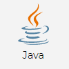
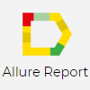

# Автотесты для [DataArt.team](https://dataart.team "DataArt.team")
# Стек технологий
## Тесты

## Инфраструктура

## Интеграция

---------------

# Видео-пример прохождения теста

---------------

## Архитектура проекта

### [Jenkins job](https://jenkins.autotests.cloud/view/QA.GURU_4/job/C04-G14-Vitaliy-qa_guru_4_24_Diploma/ "Jenkins job")
- [x] В качестве CI системы использован Jenkins

### [Allure TestOps](https://allure.autotests.cloud/project/180/dashboards "Allure TestOps")
- [x] В качестве тест-менеджмент системы использован Allure TestOps

### [Allure report](https://jenkins.autotests.cloud/view/QA.GURU_4/job/C04-G14-Vitaliy-qa_guru_4_24_Diploma/allure/ "Allure report")
- [x] Подключен Allure Report

### [Jira issue](https://jira.autotests.cloud/browse/QC3-39 "Jira issue")
- [x] Настроена интеграция с Jira

### [Telegram notification](https://t.me/joinchat/1VaD2Kb36OlhOGRi "Telegram notification")
- [x] Отправка в Telegram отчёта о пройденных тестах

